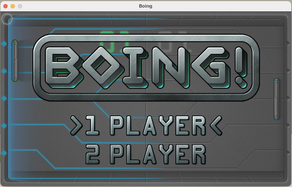
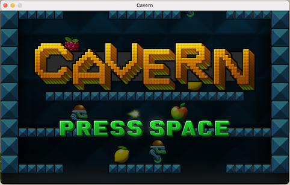
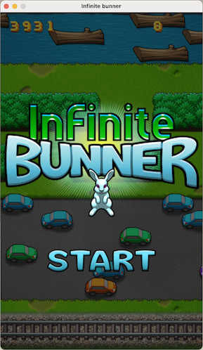
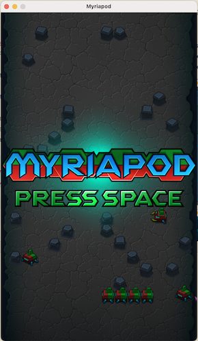

# Code the classics

This project aims to port into PHP the games of [Code the classics Vol. 1](https://wireframe.raspberrypi.org/books/code-the-classics1) originally developed in Python.

It's not a web game with the backend in PHP but a fully PHP game. 

It is possible thanks to the [Php-SDL extension](https://github.com/Ponup/php-sdl).
You need also two PHP extensions for [SDL_mixer](https://github.com/kea/php-sdl-mixer) (sound) and [SDL_image](https://github.com/kea/php-sdl-image) (multiple image format loader).






# Porting status

- Boing! [Ready]
- Cavern [Ready]
- Infinite bunner [Ready 99%]
- Myriapod [Playable 95%]
- Substitute Soccer [TBD]
## Install SDL extensions

The games in this project depend on SDL PHP extensions. You can follow the [installation](INSTALL.md) instructions to get those extensions via PECL, source or PHPBrew.

## Run the games

You have to clone this repo (or download the archive) and run composer:

```bash
git clone https://github.com/kea/code-the-classics1-php.git
cd code-the-classics1-php
composer install
```

### Boing
```bash
php src/Boing/boing.php
```

Menu selection <kbd>Up</kbd>, <kbd>Down</kbd> and <kbd>Space</kbd> to confirm.

Player 1 keys: <kbd>Up</kbd> or <kbd>a</kbd> and <kbd>Down</kbd> or <kbd>z</kbd>

Player 2 keys: <kbd>k</kbd> and <kbd>m</kbd>

### Bunner

```bash
php src/Bunner/bunner.php
```

Menu <kbd>Space</kbd> to start.

Player keys: <kbd>wasd</kbd> or <kbd>←↑→↓</kbd> to move.

### Cavern

```bash
php src/Cavern/cavern.php
```
Menu <kbd>Space</kbd> to start.

Player keys: <kbd>a d</kbd> or <kbd>← →</kbd> to move left and right, <kbd>w</kbd> or <kbd>↑</kbd> to jump and <kbd>space</kbd> to fire bubbles.

### Myriapod

```bash
php src/Myriapod/myriapod.php
```
Menu <kbd>Space</kbd> to start.

Player keys: <kbd>wasd</kbd> or <kbd>←↑→↓</kbd> to move and <kbd>space</kbd> to fire laser.

## Copyright of assets

The assets are Creative Commons Attribution-NonCommercial-ShareAlike 3.0 Unported (CC BY-NC-SA 3.0) by [Code the classics Vol. 1](https://wireframe.raspberrypi.org/books/code-the-classics1) 

